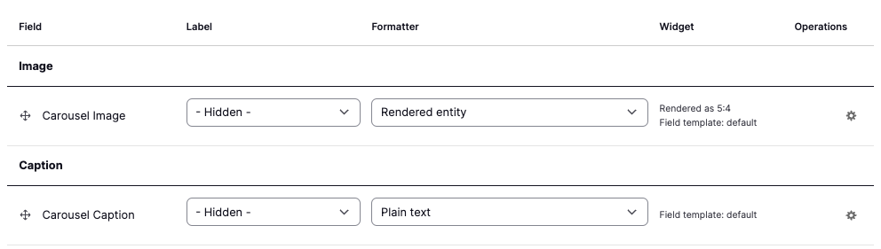
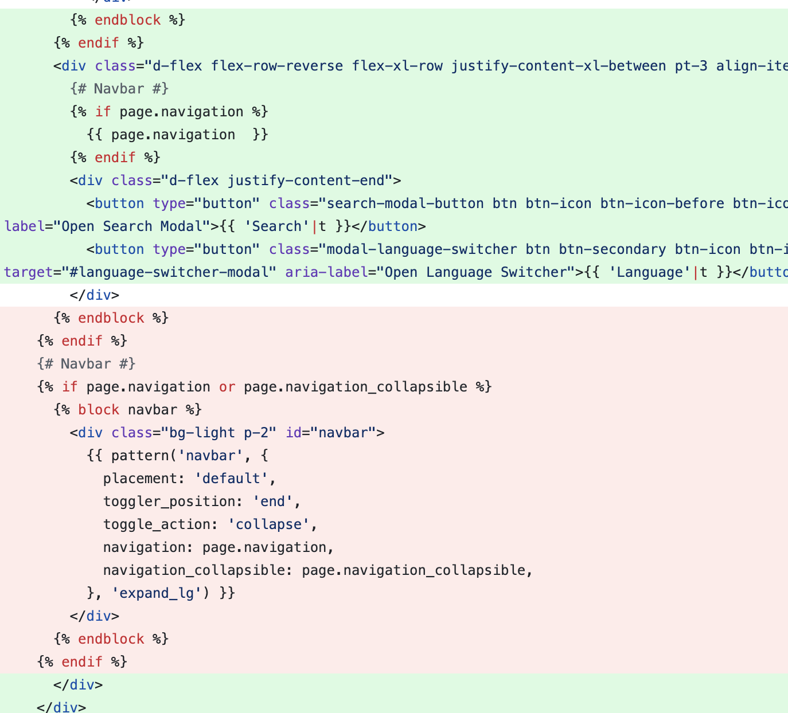
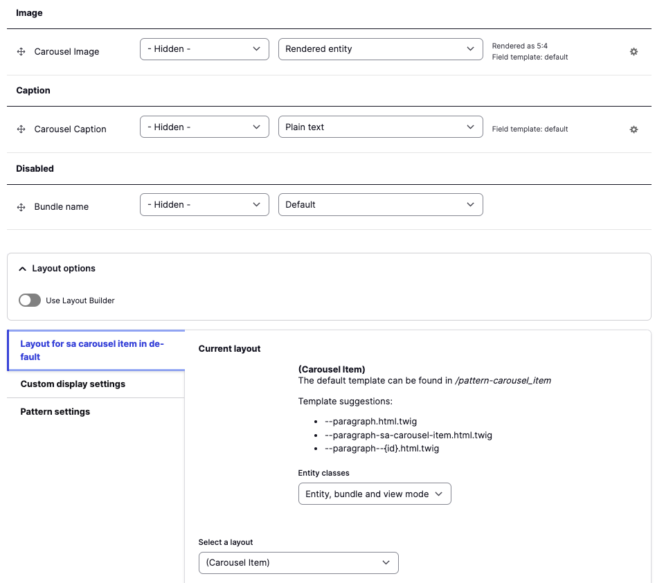
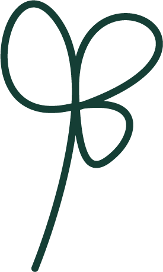
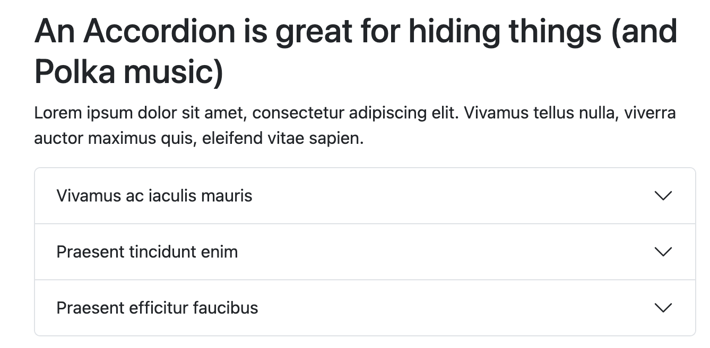

# Components

## Component Styles Overview

Each paragraph comes with a set of styles that can be updated for the display of that section. The styles are nested in a dropdown section below each of the paragraph edit forms. Included styles are listed below.

- **Margin**

  Options:
    * Top and Bottom Small
    * Top and Bottom Medium
    * Top and Bottom Large
    * Top Small
    * Top Medium
    * Top Large
    * Bottom Small
    * Bottom Medium
    * Bottom Large
- **Padding**

  Options:
    * Top and Bottom Small
    * Top and Bottom Medium
    * Top and Bottom Large
    * Top Small
    * Top Medium
    * Top Large
    * Bottom Small
    * Bottom Medium
    * Bottom Large
- **Container**

  Options:
    * Standard (this is the standard container width)
    * Container Fluid (this will cause the container to be full width
- **Width**

  Options:
    * 75%
    * 50%
    * 33%
    * 25%
**Background**

  Options:
    * Primary
    * Secondary
    * Dark
    * Light

The default options can be altered after installation. Currently the only options that have default settings are:
* Padding: Top and Bottom Medium
* Container: Standard

## Accordion/Accordion Item

1. To add an accordion paragraph type, create a new Page content.
2. From the Components dropdown, choose an accordion
3. Add a Header and a description if you would like
4. Add individual Accordion Items.
5. Styles that are set on the Accordion will affect the entire accordion section

## Block

1. To add a Block paragraph type, create a new Page content.
2. From the Components dropdown, choose a Block
3. Add a Header and a description if you would like
4. Choose the block that you would like to display
5. Styles that are set on the Block will affect the entire Block section

Fields:
* Title
* Description
* Block

Styles:
* Background
* Width
* Margin
* Padding - Default is Top and Bottom Medium
* Container - Default is Standard Container

## Card

1. To add a Card paragraph type, when editing Page content, from the Components dropdown, choose a Card.
2. Add a Header for the Card Title and a description for the card body
3. Add media for the card image
4. Add a link to display a link in the card footer.

### For Developers:

To alter the display of your card to Horizontal, go to the Manage Display Tab, Click on Pattern Settings, and for the Variant dropdown, choose Horizontal.

To alter the display of the link for your card, in the Manage display tab, Edit the pattern variant for the link. The Variant determines which bootstrap button style variable will be printed.

In addition, there is a setting that allows you to link the entire card, or to turn that off.

Slots:

* Image
* Header
* Content
* Footer

## Filtered List

A filtered list component displays predefined views.

Fields:

* Title
* Description
* Filtered List Dropdown
* Display
* Options

Styles:

* Background
* Width
* Margin
* Padding - Default is Top and Bottom Medium
* Container - Default is Standard Container

## Text

A text component allows for text to be added to a page with a wysiwyg editor.

Fields:

* Title
* Description

Styles:

* Background
* Width
* Margin
* Padding - Default is Top and Bottom Medium
* Container - Default is Standard Container

##

>>>>>  gd2md-html alert: inline image link here (to assets/images/image15.png). Store image on your image server and adjust path/filename/extension if necessary.  (<a href="#">Back to top</a>)(<a href="#gdcalert16">Next alert</a>) >>>>> 

## Columns

A columns component allows for a text, card, block, media, carousel and block component to be added as columns..

Fields:

* Title
* Description
* Column Items

Styles:

* Background
* Width
* Margin
* Padding - Default is Top and Bottom Medium
* Container - Default is Standard Container
* Columns Mobile
* Columns Desktop
* Columns Tablet
* Column Gutters
* Justify Content
* Align Items

>>>>>  gd2md-html alert: inline image link here (to assets/images/image16.png). Store image on your image server and adjust path/filename/extension if necessary.  (<a href="#">Back to top</a>)(<a href="#gdcalert17">Next alert</a>) >>>>> 

## Media

A media component allows for either an image or video media entity to be added.

Fields:

* Title
* Description
* Media

Styles:

* Background
* Width
* Margin
* Padding - Default is Top and Bottom Medium
* Container - Default is Standard Container

Remote Video Example

>>>>>  gd2md-html alert: inline image link here (to assets/images/image17.png). Store image on your image server and adjust path/filename/extension if necessary.  (<a href="#">Back to top</a>)(<a href="#gdcalert18">Next alert</a>) >>>>> 

## Tabs

A tabs component allows for multiple tabs to be added to display content in a tabbed display that will show and hide tabbed content on click.

The Tabs Component has the following fields:

Fields:

* Title
* Description
* Tab Item

Styles:

* Background
* Width
* Margin
* Padding - Default is Top and Bottom Medium
* Container - Default is Standard Container

>>>>>  gd2md-html alert: inline image link here (to assets/images/image18.png). Store image on your image server and adjust path/filename/extension if necessary.  (<a href="#">Back to top</a>)(<a href="#gdcalert19">Next alert</a>) >>>>> 

## Carousel

A Carousel component allows for multiple media items to be displayed in a carousel

The Carousel Component has the following fields:

Fields:

* Title
* Description
* Carousel Item

Styles:

* Background
* Width
* Margin
* Padding - Default is Top and Bottom Medium
* Container - Default is Standard Container

The carousel settings are defined by the Carousel Pattern being used on the Manage Display page of the paragraph. /admin/structure/paragraphs_type/sa_carousel/display

The Carousel Item field is using the pattern of Carousel.

Available options are:

* With Controls
* With Indicators
* With touch Swiping
* Token for Interval
* ID

>>>>>  gd2md-html alert: inline image link here (to assets/images/image19.png). Store image on your image server and adjust path/filename/extension if necessary.  (<a href="#">Back to top</a>)(<a href="#gdcalert20">Next alert</a>) >>>>> 

The referenced Carousel Item Paragraph type is using the pattern of Carousel Item which has the following slots:

* Image
* Caption

To manage the display, visit this URL `admin/structure/paragraphs_type/sa_carousel_item/display`

On the display page you can also alter the image style that is loaded.

>>>>>  gd2md-html alert: inline image link here (to assets/images/image20.png). Store image on your image server and adjust path/filename/extension if necessary.  (<a href="#">Back to top</a>)(<a href="#gdcalert21">Next alert</a>) >>>>> 

>>>>>  gd2md-html alert: inline image link here (to assets/images/image21.png). Store image on your image server and adjust path/filename/extension if necessary.  (<a href="#">Back to top</a>)(<a href="#gdcalert22">Next alert</a>) >>>>> 

## Side By Side

The side by side component offers a header, text field and a media field for displaying the content. The default display of content is the Media on the left and the Header and Description on the right. The columns will display as equal columns. If the Boolean for Reverse Order is turned on, The Media will display on the right side instead.

>>>>>  gd2md-html alert: inline image link here (to assets/images/image22.png). Store image on your image server and adjust path/filename/extension if necessary.  (<a href="#">Back to top</a>)(<a href="#gdcalert23">Next alert</a>) >>>>> 

Fields:

* Header
* Description
* Media

Styles:

* Background
* Width
* Margin
* Padding - Default is Top and Bottom Medium
* Container - Default is Standard Container
* Reverse Order

## Hero

The hero components allows for either a background video or image and a text overlay.

 \
Example here at the bottom of the page:

https://dev-saplingscms.pantheonsite.io/

>>>>>  gd2md-html alert: inline image link here (to assets/images/image23.png). Store image on your image server and adjust path/filename/extension if necessary.  (<a href="#">Back to top</a>)(<a href="#gdcalert24">Next alert</a>) >>>>> 

Fields:

* Header
* Description
* Media

Styles:

* Background
* Width
* Margin
* Padding - Default is Top and Bottom Medium
* Container - Default is Standard Container
* Reverse Order

