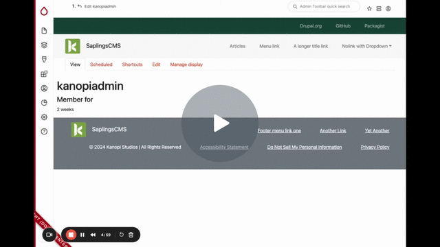
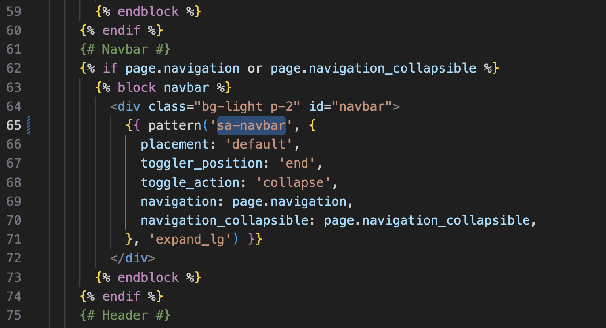

# Menus

[Saplings Built-in Menus - Watch Video](https://www.loom.com/share/d0ccb3745b284b6285af1f1817813ab3)

## Banner

Placed above the main menu section.

## Social

Placed in the footer section between the legal and Footer Menus.

To add a social media icon to the menu, click in the Bootstrap Icon field and search for the icon you are looking for, i.e. Facebook or Instagram. Choose your icon. To display only the icon, choose “Without text” under the Appearance dropdown. The icons are provided by this [menu_bootstrap_icon module ](https://www.drupal.org/project/menu_bootstrap_icon).

## Main Menu

The base install allows for No link parent level menu items that are displayed as a dropdown on click on desktop devices.

If you need to allow the parent item to be a link and then have a dropdown indicator to access child menu items, see the [Saplings Navbar module](https://github.com/kanopi/saplings_navbar)

This can be set by editing the /saplings_child/templates/overrides/page.html.twig template and switching out the pattern used for **sa-navbar**.

## Legal

Displays below the footer menu.

## Footer

Displays menu links in the footer.
