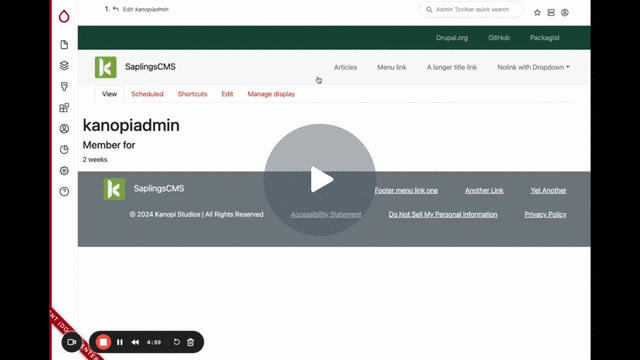

# Media

[Sapling Media Types and Responsive Image Styles - Watch Video](https://www.loom.com/share/999be51038f94b57a2e4da27e2a15c17)

## Media entities

Saplings uses Drupal core's standard media entities. These media entities include:

- Audio
- Document
- Image
- Remote Video
- Video

### Easy Responsive Image styles

Saplings uses the Easy Responsive Image module to create view modes, and image display widgets for each aspect ratio. This does not use core's responsive image entities, but the behavior is similar.

The aspect ratios we ship with are:

* 21:9
* 9:21
* 16:9
* 9:16
* 16:3
* 3:16
* 5:4
* 4:5
* 5:2
* 2:5
* 4:3
* 3:4
* 3:2
* 2:3
* 2:1
* 1:2
* 1:1
