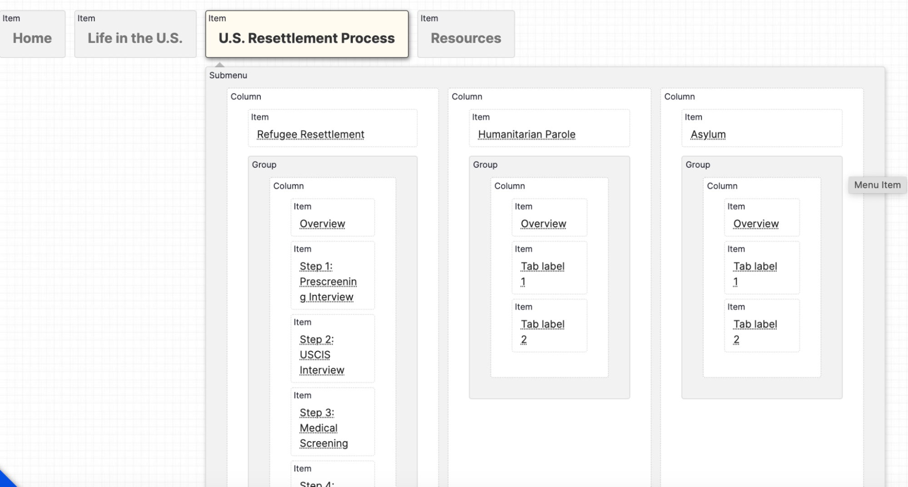

# Adding a Mega Menu to Saplings

1. Install TB Megamenu and set up your menu
    1. I used "drupal/tb_megamenu": "^3.0@alpha",
    2. But on Parks there was an issue that we needed to use the dev version for: [https://www.drupal.org/project/tb_megamenu/issues/3441346](https://www.drupal.org/project/tb_megamenu/issues/3441346) 



2. Remove Main navigation block from the block layout and put the TB megamenu block there instead
3. Add a tb-megamenu-nav.html.twig template file to add a language switcher button

```
<ul {{ attributes }} >
 
  {{ li }}
 
</ul>
<button type="button" class="modal-language-switcher btn btn-secondary btn-icon btn-icon-before btn-icon-after btn-icon-translate w-100 justify-content-center" data-bs-target="#language-switcher-modal" aria-label="Open Language Switcher">{{ 'Language'|t }}</button>
```

4. Add tb-megamenu.html.twig template to customize the mobile toggle button

```

<style type="text/css">
.tbm.animate .tbm-item > .tbm-submenu, .tbm.animate.slide .tbm-item > .tbm-submenu > div {
 {{ css_style }}
 }
</style>

<nav {{ attributes }}>
 
  <div class="mobile-menu-button">
    <button class="tbm-button btn btn-secondary btn-icon btn-icon-after btn-icon-chevron-down" type="button" data-bs-target="#menu-modal" aria-label="Open Main Menu"><span class="open-menu">{{ 'Menu'|t }}</span><span class="close-menu">{{ 'Close'|t }}</span>
    </button>
  </div>
  <div class="tbm-collapse {{ block_config['always-show-submenu'] ? ' always-show' : '' }}">
 
 {{ content }}
 
  </div>
 
</nav>

<script>
{# Add the .tbm--mobile class before there is a chance for a flash of unstyled content. #}

if (window.matchMedia("(max-width: {{ block_config['breakpoint']}}px)").matches) {
 document.getElementById("{{ attributes.id }}").classList.add('tbm--mobile');
}

{# Add the .tbm--mobile-hide class if needed. #}

 document.getElementById('{{ attributes.id }}').classList.add('tbm--mobile-hide');
```

5. Remove the navbar pattern from the page.html.twig template and just print the region you put the TB megamenu in


6. Here is the SCSS used to style the tbm menu on SettleIn

```
.tbm {
 background-color: transparent;
 .tbm-button {
  display: none;
 }
}

.tbm-submenu {
 top: calc(100% + 1.5rem);
 border-radius: 2rem;
 border: none;
 padding: 3rem;

 @media (max-width: 1400px) {
  width: 1118px;
  left: -172px;
 }

 @media (min-width: 1400px) {
  width: 1296px;
  left: -172px;
 }

 .tbm-row:nth-child(2), .tbm-row:nth-child(3) {
  border-top: 1px solid #B7D0C64D;
  margin-top: 2rem;
  padding-top: 2rem;
 }

 .tbm-group-container {
  border-top: 0;
 }

 .tbm-group-title {
  text-transform: none;
  font-size: 1.5rem;
 }
}

.tbm-collapse {
 .modal-language-switcher {
  display: none;
 }
}

.tbm-item.level-1 {
 border: none;
 .tbm-link.level-1 {
  margin: 0 2rem 0 0;
  padding: 0;
  font-family: 'Literata', serif;
  font-size: 1.125rem;
  &:hover {
    background-color: transparent;
  }
 }
}

.tbm-item.level-1:nth-child(2) {
 .tbm-subnav.level-1 {
  columns: 4;
 }
}

.tbm-item--has-dropdown.level-1 {
 .tbm-link.level-1{
  &::after {
    display: inline-block;
    font-family: bootstrap-icons !important;
    font-style: normal;
    font-weight: bold !important;
    line-height: 1;
    font-size: 1rem;
    content: '\F282';
    margin-left: 0.5rem;
    color: $settle-blue;
    transition-duration: 300ms;
    transition-timing-function: ease-in-out;
  }
 }

 &.open {
  .tbm-link.level-1{
    &::after {
     rotate: 180deg;
     transition-duration: 300ms;
     transition-timing-function: ease-in-out;
    }
  }
 }

 .tbm-submenu-toggle{
  &:hover {
    background-color: transparent;
  }
 }

 .tbm-link.level-2 {
  font-weight: 700;
 }
}

.tbm.tbm--mobile .tbm-button {
 display: inline-flex;
 margin-bottom: 0;
 span {
  font-weight: 700;
 }

 .close-menu {
  display: none;
 }
}

.navbar-toggler {
 display: none;
}
.tbm.tbm--mobile {
 overflow: scroll;
 .tbm-item {
  border-top: none;
  padding: 1rem;
 }

 .tbm-item.level-1:nth-child(2) .tbm-subnav.level-1 {
  columns: 1;
 }

 .tbm-nav {
  background-color: transparent;
  .tbm-item.level-1 {
    .tbm-link.level-1  {
     font-family: 'DM Sans', sans-serif;
     margin-right: 0;
     justify-content: space-between;
     font-size: 1.5rem;
     font-weight: 700;

     &::after {
      font-size: 1.5rem;
     }
    }
  }
 }

 .tbm-submenu-toggle {
  display: none;
 }

 .tbm-submenu {
  background: transparent;
  border: none;
  .tbm-link {
    padding: 0;
  }
 }

 .tbm-link.level-2 {
  font-size: 1.125rem;
  font-weight: 400;
 }

 .tbm-group-title {
  font-weight: 700;
 }

 .tbm-item.level-1:nth-child(3) {
  .tbm-link.level-2 {
    font-weight: 700;
  }
 }


 .tbm-row:nth-child(2), .tbm-row:nth-child(3) {
  border-top: none;
 }
}

.tbm--mobile-show {
 position: fixed;
 top: 0;
 left: 0;
 width: 100%;
 height: 100%;
 background: linear-gradient(rgba(235, 255, 242, 1), rgba(250, 255, 252, 1));
 z-index: 12;

 .close-menu {
  display: block !important;
 }

 .open-menu {
  display: none;
 }

 .tbm-collapse  {
  display: block;
  position: unset !important;
  background: transparent !important;
  --bs-gutter-x: 1.5rem;
  --bs-gutter-y: 0;
  width: 100%;
  padding-right: calc(var(--bs-gutter-x)* 0.5);
  padding-left: calc(var(--bs-gutter-x)* 0.5);
  margin-right: auto;
  margin-left: auto;

  @media (min-width: 576px) {
    max-width: 540px;
  }

  @media (min-width: 768px) {
    max-width: 720px;
  }

  @media (min-width: 992px) {
    max-width: 960px;
  }

  .modal-language-switcher {
    display: inline-flex;
  }
 }

 .mobile-menu-button {
  position: relative;
  height: 54px;

  margin-top: 24px;
  --bs-gutter-x: 1.5rem;
  --bs-gutter-y: 0;
  width: 100%;
  padding-right: calc(var(--bs-gutter-x)* 0.5);
  padding-left: calc(var(--bs-gutter-x)* 0.5);
  margin-right: auto;
  margin-left: auto;

  @media (min-width: 576px) {
    max-width: 540px;
  }

  @media (min-width: 768px) {
    max-width: 720px;
  }

  @media (min-width: 992px) {
    max-width: 960px;
  }

  button {
    position: absolute;
    right: 12px;

    &::after {
     content: '\F62A' !important;
    }
  }
 }
```
