# kanopi/saplings Dependencies

## Dependency Graph

```mermaid
graph LR
    kanopi/saplings -->|">=10.4"| drupal/core
    kanopi/saplings -->|"^1"| kanopi/gin-admin-experience
    kanopi/saplings -->|"^1"| kanopi/saplings-base
    kanopi/saplings -->|"^1"| kanopi/saplings-content-types
    kanopi/saplings -->|"^1.0.0-beta.9"| kanopi/saplings-editorial
    kanopi/saplings -->|"^1.0.0.beta.6"| kanopi/saplings-launch
    kanopi/saplings -->|"^1"| kanopi/saplings-tests
    kanopi/gin-admin-experience -->|"^3.5"| drupal/admin_toolbar
    kanopi/gin-admin-experience -->|">=10.4"| drupal/core
    kanopi/gin-admin-experience -->|"^3.0@RC"| drupal/gin
    kanopi/gin-admin-experience -->|"^2.1"| drupal/gin_login
    kanopi/gin-admin-experience -->|"^1.0@RC"| drupal/gin_toolbar
    kanopi/saplings-base -->|"^4.0"| drupal/block_class
    kanopi/saplings-base -->|">=10.4"| drupal/core
    kanopi/saplings-base -->|"^1.19"| drupal/critical_css
    kanopi/saplings-base -->|"^1.1"| drupal/diff
    kanopi/saplings-base -->|"^2.0"| drupal/easy_breadcrumb
    kanopi/saplings-base -->|"^2.0"| drupal/google_tag
    kanopi/saplings-base -->|"^1.5"| drupal/menu_link_attributes
    kanopi/saplings-base -->|"^1.8"| drupal/pathauto
    kanopi/saplings-base -->|"^1.9"| drupal/redirect
    kanopi/saplings-base -->|"^4"| drupal/simple_sitemap
    kanopi/saplings-base -->|"^2.0"| drupal/sitemap
    kanopi/saplings-base -->|"^2"| drupal/tour
    kanopi/saplings-base -->|"^1"| drupal/tour_core
    kanopi/saplings-base -->|"^2.0@beta"| drupal/ultimate_cron
    kanopi/saplings-content-types -->|"^1.6"| drupal/access_unpublished
    kanopi/saplings-content-types -->|"^2.12"| drupal/entity_browser
    kanopi/saplings-content-types -->|"^4.0@alpha"| drupal/field_group
    kanopi/saplings-content-types -->|"^3.0.0@rc"| drupal/inline_entity_form
    kanopi/saplings-content-types -->|"^2.1"| drupal/metatag
    kanopi/saplings-content-types -->|"^1.13"| drupal/pathauto
    kanopi/saplings-content-types -->|"^3"| drupal/publication_date
    kanopi/saplings-content-types -->|"^2.1"| drupal/scheduler
    kanopi/saplings-content-types -->|"^3"| drupal/scheduler_content_moderation_integration
    kanopi/saplings-content-types -->|"^3"| drupal/schema_metatag
    kanopi/saplings-content-types -->|"^4.2"| drupal/simple_sitemap
    kanopi/saplings-content-types -->|"^2.3"| drupal/token_or
    kanopi/saplings-content-types -->|"^2"| drupal/tour
    kanopi/saplings-content-types -->|"^1.0.0-beta.29"| kanopi/saplings-component-types
    kanopi/saplings-content-types -->|"^1.0.0-beta.10"| kanopi/saplings-content-base
    kanopi/saplings-component-types -->|"^1.0@RC"| drupal/block_field
    kanopi/saplings-component-types -->|">=10.4"| drupal/core
    kanopi/saplings-component-types -->|"^3.24"| drupal/ds
    kanopi/saplings-component-types -->|"^2.0@beta"| drupal/element_class_formatter
    kanopi/saplings-component-types -->|"^1.12"| drupal/entity_reference_revisions
    kanopi/saplings-component-types -->|"^1.0"| drupal/nomarkup
    kanopi/saplings-component-types -->|"^1.18"| drupal/paragraphs
    kanopi/saplings-component-types -->|"^3.0"| drupal/paragraphs_edit
    kanopi/saplings-component-types -->|"^2.1"| drupal/ui_patterns_field_formatters
    kanopi/saplings-component-types -->|"^2.0.x-dev@dev"| drupal/ui_patterns_field_group
    kanopi/saplings-component-types -->|"^2.0@beta"| drupal/viewsreference
    kanopi/saplings-component-types -->|"^1"| kanopi/saplings-component-base
    kanopi/saplings-component-types -->|"^1"| kanopi/saplings-full-html-editor
    kanopi/saplings-component-types -->|"^1"| kanopi/saplings-media
    kanopi/saplings-component-base -->|"^1.16"| drupal/paragraphs
    kanopi/saplings-component-base -->|"^1.0"| kanopi/saplings_paragraphs
    kanopi/saplings_paragraphs -->|"^1.0"| drupal/paragraphs
    kanopi/saplings-full-html-editor -->|">=10.4"| drupal/core
    kanopi/saplings-full-html-editor -->|"^2"| drupal/editor_advanced_link
    kanopi/saplings-full-html-editor -->|"^7"| drupal/linkit
    kanopi/saplings-full-html-editor -->|"^2"| drupal/responsive_tables_filter
    kanopi/saplings-media -->|">=10.4"| drupal/core
    kanopi/saplings-media -->|"^1.4"| drupal/easy_responsive_images
    kanopi/saplings-media -->|"^2.1"| drupal/focal_point
    kanopi/saplings-media -->|"^2.4"| drupal/media_entity_download
    kanopi/saplings-media -->|"^1.3"| drupal/media_file_delete
    kanopi/saplings-media -->|"^3.0"| drupal/media_library_edit
    kanopi/saplings-media -->|"^1.0"| drupal/lite_youtube_embed
    kanopi/saplings-media -->|"^1"| kanopi/imagemagick-configuration
    kanopi/saplings-media -->|"^v0.3.3"| npm-asset/lite-youtube-embed
    kanopi/imagemagick-configuration -->|">=10.4"| drupal/core
    kanopi/imagemagick-configuration -->|"^4.0"| drupal/imagemagick
    kanopi/saplings-content-base -->|"^1"| kanopi/saplings-fields-header
    kanopi/saplings-content-base -->|"^1"| kanopi/saplings-fields-seo
    kanopi/saplings-content-base -->|"^1"| kanopi/saplings-media
    kanopi/saplings-content-base -->|"^1.0.0-beta.12"| kanopi/saplings-theme
    kanopi/saplings-fields-header -->|"*"| drupal/field_group
    kanopi/saplings-fields-header -->|"*"| drupal/media_library_edit
    kanopi/saplings-fields-header -->|"*"| kanopi/saplings-media
    kanopi/saplings-fields-seo -->|"*"| drupal/field_group
    kanopi/saplings-fields-seo -->|"*"| drupal/media_library_edit
    kanopi/saplings-fields-seo -->|"*"| kanopi/saplings_custom
    kanopi/saplings-fields-seo -->|"*"| kanopi/saplings-media
    kanopi/saplings_custom -->|"^2.0"| drupal/metatag
    kanopi/saplings-theme -->|"^5.3.0"| bower-asset/bootstrap
    kanopi/saplings-theme -->|"^4"| drupal/block_class
    kanopi/saplings-theme -->|">=10.4"| drupal/core
    kanopi/saplings-theme -->|"^3.15"| drupal/ds
    kanopi/saplings-theme -->|"3.x-dev@dev"| drupal/field_formatter
    kanopi/saplings-theme -->|"^4.0@alpha"| drupal/field_group
    kanopi/saplings-theme -->|"^1.4"| drupal/layout_options
    kanopi/saplings-theme -->|"^1.0"| drupal/menu_bootstrap_icon
    kanopi/saplings-theme -->|"^3.3"| drupal/twig_tweak
    kanopi/saplings-theme -->|"^1.7"| drupal/ui_patterns
    kanopi/saplings-theme -->|"^2.0"| drupal/ui_patterns_field_formatters
    kanopi/saplings-theme -->|"^2.2@alpha"| drupal/ui_patterns_settings
    kanopi/saplings-theme -->|"^1.0@alpha"| drupal/ui_skins
    kanopi/saplings-theme -->|"^1.7"| drupal/ui_styles
    kanopi/saplings-theme -->|"^5.0@alpha"| drupal/ui_suite_bootstrap
    kanopi/saplings-theme -->|"^1"| kanopi/saplings_child
    kanopi/saplings-editorial -->|"^1.5"| drupal/access_unpublished
    kanopi/saplings-editorial -->|">=10.4"| drupal/core
    kanopi/saplings-editorial -->|"^4.0"| drupal/environment_indicator
    kanopi/saplings-editorial -->|"^1.16"| drupal/quick_node_clone
    kanopi/saplings-editorial -->|"^1.3"| drupal/sam
    kanopi/saplings-editorial -->|"^3"| drupal/trash
    kanopi/saplings-editorial -->|"^3"| drupal/views_bulk_edit
    kanopi/saplings-editorial -->|"^1.1"| drupal/view_unpublished
    kanopi/saplings-editorial -->|"^1"| kanopi/saplings-full-html-editor
    kanopi/saplings-launch -->|"4.x-dev@dev"| drupal/clamav
    kanopi/saplings-launch -->|">=10.4"| drupal/core
    kanopi/saplings-launch -->|"^1.1"| drupal/launch_checklist
    kanopi/saplings-launch -->|"^2.1"| drupal/remove_http_headers
    kanopi/saplings-launch -->|"1.x-dev"| drupal/resource_hints
    kanopi/saplings-launch -->|"^5.2"| drupal/seo_checklist
    kanopi/saplings-launch -->|"^2.0@beta"| drupal/scanner
    kanopi/saplings-launch -->|"^2.0"| drupal/seckit
    kanopi/saplings-launch -->|"^3"| drupal/security_review
    kanopi/saplings-launch -->|"^4.1"| drupal/site_audit
    kanopi/saplings-launch -->|"^1.5"| drupal/unused_modules
    kanopi/saplings-tests -->|"*"| kanopi/shrubs
    kanopi/shrubs -->|"^2.0"| oomphinc/composer-installers-extender
```

## Dependency List

### kanopi/saplings

- Type: drupal-recipe

#### Dependencies:

- [drupal/core](https://packagist.org/packages/drupal/core) - `>=10.4`
- [kanopi/gin-admin-experience](https://packagist.org/packages/kanopi/gin-admin-experience) - `^1`
- [kanopi/saplings-base](https://packagist.org/packages/kanopi/saplings-base) - `^1`
- [kanopi/saplings-content-types](https://packagist.org/packages/kanopi/saplings-content-types) - `^1`
- [kanopi/saplings-editorial](https://packagist.org/packages/kanopi/saplings-editorial) - `^1.0.0-beta.9`
- [kanopi/saplings-launch](https://packagist.org/packages/kanopi/saplings-launch) - `^1.0.0.beta.6`
- [kanopi/saplings-tests](https://packagist.org/packages/kanopi/saplings-tests) - `^1`
### kanopi/gin-admin-experience

- Type: drupal-recipe

#### Dependencies:

- [drupal/admin_toolbar](https://packagist.org/packages/drupal/admin_toolbar) - `^3.5`
- [drupal/core](https://packagist.org/packages/drupal/core) - `>=10.4`
- [drupal/gin](https://packagist.org/packages/drupal/gin) - `^3.0@RC`
- [drupal/gin_login](https://packagist.org/packages/drupal/gin_login) - `^2.1`
- [drupal/gin_toolbar](https://packagist.org/packages/drupal/gin_toolbar) - `^1.0@RC`
### kanopi/saplings-base

- Type: drupal-recipe

#### Dependencies:

- [drupal/block_class](https://packagist.org/packages/drupal/block_class) - `^4.0`
- [drupal/core](https://packagist.org/packages/drupal/core) - `>=10.4`
- [drupal/critical_css](https://packagist.org/packages/drupal/critical_css) - `^1.19`
- [drupal/diff](https://packagist.org/packages/drupal/diff) - `^1.1`
- [drupal/easy_breadcrumb](https://packagist.org/packages/drupal/easy_breadcrumb) - `^2.0`
- [drupal/google_tag](https://packagist.org/packages/drupal/google_tag) - `^2.0`
- [drupal/menu_link_attributes](https://packagist.org/packages/drupal/menu_link_attributes) - `^1.5`
- [drupal/pathauto](https://packagist.org/packages/drupal/pathauto) - `^1.8`
- [drupal/redirect](https://packagist.org/packages/drupal/redirect) - `^1.9`
- [drupal/simple_sitemap](https://packagist.org/packages/drupal/simple_sitemap) - `^4`
- [drupal/sitemap](https://packagist.org/packages/drupal/sitemap) - `^2.0`
- [drupal/tour](https://packagist.org/packages/drupal/tour) - `^2`
- [drupal/tour_core](https://packagist.org/packages/drupal/tour_core) - `^1`
- [drupal/ultimate_cron](https://packagist.org/packages/drupal/ultimate_cron) - `^2.0@beta`
### kanopi/saplings-content-types

- Type: drupal-recipe

#### Dependencies:

- [drupal/access_unpublished](https://packagist.org/packages/drupal/access_unpublished) - `^1.6`
- [drupal/entity_browser](https://packagist.org/packages/drupal/entity_browser) - `^2.12`
- [drupal/field_group](https://packagist.org/packages/drupal/field_group) - `^4.0@alpha`
- [drupal/inline_entity_form](https://packagist.org/packages/drupal/inline_entity_form) - `^3.0.0@rc`
- [drupal/metatag](https://packagist.org/packages/drupal/metatag) - `^2.1`
- [drupal/pathauto](https://packagist.org/packages/drupal/pathauto) - `^1.13`
- [drupal/publication_date](https://packagist.org/packages/drupal/publication_date) - `^3`
- [drupal/scheduler](https://packagist.org/packages/drupal/scheduler) - `^2.1`
- [drupal/scheduler_content_moderation_integration](https://packagist.org/packages/drupal/scheduler_content_moderation_integration) - `^3`
- [drupal/schema_metatag](https://packagist.org/packages/drupal/schema_metatag) - `^3`
- [drupal/simple_sitemap](https://packagist.org/packages/drupal/simple_sitemap) - `^4.2`
- [drupal/token_or](https://packagist.org/packages/drupal/token_or) - `^2.3`
- [drupal/tour](https://packagist.org/packages/drupal/tour) - `^2`
- [kanopi/saplings-component-types](https://packagist.org/packages/kanopi/saplings-component-types) - `^1.0.0-beta.29`
- [kanopi/saplings-content-base](https://packagist.org/packages/kanopi/saplings-content-base) - `^1.0.0-beta.10`
### kanopi/saplings-component-types

- Type: drupal-recipe

#### Dependencies:

- [drupal/block_field](https://packagist.org/packages/drupal/block_field) - `^1.0@RC`
- [drupal/core](https://packagist.org/packages/drupal/core) - `>=10.4`
- [drupal/ds](https://packagist.org/packages/drupal/ds) - `^3.24`
- [drupal/element_class_formatter](https://packagist.org/packages/drupal/element_class_formatter) - `^2.0@beta`
- [drupal/entity_reference_revisions](https://packagist.org/packages/drupal/entity_reference_revisions) - `^1.12`
- [drupal/nomarkup](https://packagist.org/packages/drupal/nomarkup) - `^1.0`
- [drupal/paragraphs](https://packagist.org/packages/drupal/paragraphs) - `^1.18`
- [drupal/paragraphs_edit](https://packagist.org/packages/drupal/paragraphs_edit) - `^3.0`
- [drupal/ui_patterns_field_formatters](https://packagist.org/packages/drupal/ui_patterns_field_formatters) - `^2.1`
- [drupal/ui_patterns_field_group](https://packagist.org/packages/drupal/ui_patterns_field_group) - `^2.0.x-dev@dev`
- [drupal/viewsreference](https://packagist.org/packages/drupal/viewsreference) - `^2.0@beta`
- [kanopi/saplings-component-base](https://packagist.org/packages/kanopi/saplings-component-base) - `^1`
- [kanopi/saplings-full-html-editor](https://packagist.org/packages/kanopi/saplings-full-html-editor) - `^1`
- [kanopi/saplings-media](https://packagist.org/packages/kanopi/saplings-media) - `^1`
### kanopi/saplings-component-base

- Type: drupal-recipe

#### Dependencies:

- [drupal/paragraphs](https://packagist.org/packages/drupal/paragraphs) - `^1.16`
- [kanopi/saplings_paragraphs](https://packagist.org/packages/kanopi/saplings_paragraphs) - `^1.0`
### kanopi/saplings_paragraphs

- Type: drupal-module

#### Dependencies:

- [drupal/paragraphs](https://packagist.org/packages/drupal/paragraphs) - `^1.0`
### kanopi/saplings-full-html-editor

- Type: drupal-recipe

#### Dependencies:

- [drupal/core](https://packagist.org/packages/drupal/core) - `>=10.4`
- [drupal/editor_advanced_link](https://packagist.org/packages/drupal/editor_advanced_link) - `^2`
- [drupal/linkit](https://packagist.org/packages/drupal/linkit) - `^7`
- [drupal/responsive_tables_filter](https://packagist.org/packages/drupal/responsive_tables_filter) - `^2`
### kanopi/saplings-media

- Type: drupal-recipe

#### Dependencies:

- [drupal/core](https://packagist.org/packages/drupal/core) - `>=10.4`
- [drupal/easy_responsive_images](https://packagist.org/packages/drupal/easy_responsive_images) - `^1.4`
- [drupal/focal_point](https://packagist.org/packages/drupal/focal_point) - `^2.1`
- [drupal/media_entity_download](https://packagist.org/packages/drupal/media_entity_download) - `^2.4`
- [drupal/media_file_delete](https://packagist.org/packages/drupal/media_file_delete) - `^1.3`
- [drupal/media_library_edit](https://packagist.org/packages/drupal/media_library_edit) - `^3.0`
- [drupal/lite_youtube_embed](https://packagist.org/packages/drupal/lite_youtube_embed) - `^1.0`
- [kanopi/imagemagick-configuration](https://packagist.org/packages/kanopi/imagemagick-configuration) - `^1`
- [npm-asset/lite-youtube-embed](https://packagist.org/packages/npm-asset/lite-youtube-embed) - `^v0.3.3`
### kanopi/imagemagick-configuration

- Type: drupal-recipe

#### Dependencies:

- [drupal/core](https://packagist.org/packages/drupal/core) - `>=10.4`
- [drupal/imagemagick](https://packagist.org/packages/drupal/imagemagick) - `^4.0`
### kanopi/saplings-content-base

- Type: drupal-recipe

#### Dependencies:

- [kanopi/saplings-fields-header](https://packagist.org/packages/kanopi/saplings-fields-header) - `^1`
- [kanopi/saplings-fields-seo](https://packagist.org/packages/kanopi/saplings-fields-seo) - `^1`
- [kanopi/saplings-media](https://packagist.org/packages/kanopi/saplings-media) - `^1`
- [kanopi/saplings-theme](https://packagist.org/packages/kanopi/saplings-theme) - `^1.0.0-beta.12`
### kanopi/saplings-fields-header

- Type: drupal-recipe

#### Dependencies:

- [drupal/field_group](https://packagist.org/packages/drupal/field_group) - `*`
- [drupal/media_library_edit](https://packagist.org/packages/drupal/media_library_edit) - `*`
- [kanopi/saplings-media](https://packagist.org/packages/kanopi/saplings-media) - `*`
### kanopi/saplings-fields-seo

- Type: drupal-recipe

#### Dependencies:

- [drupal/field_group](https://packagist.org/packages/drupal/field_group) - `*`
- [drupal/media_library_edit](https://packagist.org/packages/drupal/media_library_edit) - `*`
- [kanopi/saplings_custom](https://packagist.org/packages/kanopi/saplings_custom) - `*`
- [kanopi/saplings-media](https://packagist.org/packages/kanopi/saplings-media) - `*`
### kanopi/saplings_custom

- Type: drupal-module

#### Dependencies:

- [drupal/metatag](https://packagist.org/packages/drupal/metatag) - `^2.0`
### kanopi/saplings-theme

- Type: drupal-recipe

#### Dependencies:

- [bower-asset/bootstrap](https://packagist.org/packages/bower-asset/bootstrap) - `^5.3.0`
- [drupal/block_class](https://packagist.org/packages/drupal/block_class) - `^4`
- [drupal/core](https://packagist.org/packages/drupal/core) - `>=10.4`
- [drupal/ds](https://packagist.org/packages/drupal/ds) - `^3.15`
- [drupal/field_formatter](https://packagist.org/packages/drupal/field_formatter) - `3.x-dev@dev`
- [drupal/field_group](https://packagist.org/packages/drupal/field_group) - `^4.0@alpha`
- [drupal/layout_options](https://packagist.org/packages/drupal/layout_options) - `^1.4`
- [drupal/menu_bootstrap_icon](https://packagist.org/packages/drupal/menu_bootstrap_icon) - `^1.0`
- [drupal/twig_tweak](https://packagist.org/packages/drupal/twig_tweak) - `^3.3`
- [drupal/ui_patterns](https://packagist.org/packages/drupal/ui_patterns) - `^1.7`
- [drupal/ui_patterns_field_formatters](https://packagist.org/packages/drupal/ui_patterns_field_formatters) - `^2.0`
- [drupal/ui_patterns_settings](https://packagist.org/packages/drupal/ui_patterns_settings) - `^2.2@alpha`
- [drupal/ui_skins](https://packagist.org/packages/drupal/ui_skins) - `^1.0@alpha`
- [drupal/ui_styles](https://packagist.org/packages/drupal/ui_styles) - `^1.7`
- [drupal/ui_suite_bootstrap](https://packagist.org/packages/drupal/ui_suite_bootstrap) - `^5.0@alpha`
- [kanopi/saplings_child](https://packagist.org/packages/kanopi/saplings_child) - `^1`
### kanopi/saplings_child

- Type: drupal-theme

#### Dependencies:

### kanopi/saplings-editorial

- Type: drupal-recipe

#### Dependencies:

- [drupal/access_unpublished](https://packagist.org/packages/drupal/access_unpublished) - `^1.5`
- [drupal/core](https://packagist.org/packages/drupal/core) - `>=10.4`
- [drupal/environment_indicator](https://packagist.org/packages/drupal/environment_indicator) - `^4.0`
- [drupal/quick_node_clone](https://packagist.org/packages/drupal/quick_node_clone) - `^1.16`
- [drupal/sam](https://packagist.org/packages/drupal/sam) - `^1.3`
- [drupal/trash](https://packagist.org/packages/drupal/trash) - `^3`
- [drupal/views_bulk_edit](https://packagist.org/packages/drupal/views_bulk_edit) - `^3`
- [drupal/view_unpublished](https://packagist.org/packages/drupal/view_unpublished) - `^1.1`
- [kanopi/saplings-full-html-editor](https://packagist.org/packages/kanopi/saplings-full-html-editor) - `^1`
### kanopi/saplings-launch

- Type: drupal-recipe

#### Dependencies:

- [drupal/clamav](https://packagist.org/packages/drupal/clamav) - `4.x-dev@dev`
- [drupal/core](https://packagist.org/packages/drupal/core) - `>=10.4`
- [drupal/launch_checklist](https://packagist.org/packages/drupal/launch_checklist) - `^1.1`
- [drupal/remove_http_headers](https://packagist.org/packages/drupal/remove_http_headers) - `^2.1`
- [drupal/resource_hints](https://packagist.org/packages/drupal/resource_hints) - `1.x-dev`
- [drupal/seo_checklist](https://packagist.org/packages/drupal/seo_checklist) - `^5.2`
- [drupal/scanner](https://packagist.org/packages/drupal/scanner) - `^2.0@beta`
- [drupal/seckit](https://packagist.org/packages/drupal/seckit) - `^2.0`
- [drupal/security_review](https://packagist.org/packages/drupal/security_review) - `^3`
- [drupal/site_audit](https://packagist.org/packages/drupal/site_audit) - `^4.1`
- [drupal/unused_modules](https://packagist.org/packages/drupal/unused_modules) - `^1.5`
### kanopi/saplings-tests

- Type: cypress-e2e

#### Dependencies:

- [kanopi/shrubs](https://packagist.org/packages/kanopi/shrubs) - `*`
### kanopi/shrubs

- Type: cypress-support

#### Dependencies:

- [oomphinc/composer-installers-extender](https://packagist.org/packages/oomphinc/composer-installers-extender) - `^2.0`
---

Generated using [thejimbirch/dependgen](https://github.com/thejimbirch/dependgen).
