# kanopi/saplings Dependencies

## Dependency Graph

```mermaid
graph TB
    kanopi/saplings((kanopi/saplings))
    kanopi/saplings --> drupal/core
    kanopi/saplings --> kanopi/gin-admin-experience
    kanopi/saplings --> kanopi/saplings-base
    kanopi/saplings --> kanopi/saplings-content-types
    kanopi/saplings --> kanopi/saplings-editorial
    kanopi/saplings --> kanopi/saplings-launch
    kanopi/saplings --> kanopi/saplings-tests
    kanopi/gin-admin-experience((kanopi/gin-admin-experience))
    kanopi/gin-admin-experience --> drupal/admin_toolbar
    kanopi/gin-admin-experience --> drupal/core
    kanopi/gin-admin-experience --> drupal/gin
    kanopi/gin-admin-experience --> drupal/gin_login
    kanopi/gin-admin-experience --> drupal/gin_toolbar
    kanopi/saplings-base((kanopi/saplings-base))
    kanopi/saplings-base --> drupal/block_class
    kanopi/saplings-base --> drupal/core
    kanopi/saplings-base --> drupal/critical_css
    kanopi/saplings-base --> drupal/diff
    kanopi/saplings-base --> drupal/easy_breadcrumb
    kanopi/saplings-base --> drupal/google_tag
    kanopi/saplings-base --> drupal/menu_link_attributes
    kanopi/saplings-base --> drupal/pathauto
    kanopi/saplings-base --> drupal/redirect
    kanopi/saplings-base --> drupal/simple_sitemap
    kanopi/saplings-base --> drupal/sitemap
    kanopi/saplings-base --> drupal/tour
    kanopi/saplings-base --> drupal/tour_core
    kanopi/saplings-base --> drupal/ultimate_cron
    kanopi/saplings-content-types((kanopi/saplings-content-types))
    kanopi/saplings-content-types --> drupal/access_unpublished
    kanopi/saplings-content-types --> drupal/entity_browser
    kanopi/saplings-content-types --> drupal/field_group
    kanopi/saplings-content-types --> drupal/inline_entity_form
    kanopi/saplings-content-types --> drupal/metatag
    kanopi/saplings-content-types --> drupal/pathauto
    kanopi/saplings-content-types --> drupal/publication_date
    kanopi/saplings-content-types --> drupal/scheduler
    kanopi/saplings-content-types --> drupal/scheduler_content_moderation_integration
    kanopi/saplings-content-types --> drupal/schema_metatag
    kanopi/saplings-content-types --> drupal/simple_sitemap
    kanopi/saplings-content-types --> drupal/token_or
    kanopi/saplings-content-types --> drupal/tour
    kanopi/saplings-content-types --> kanopi/saplings-component-types
    kanopi/saplings-content-types --> kanopi/saplings-content-base
    kanopi/saplings-component-types((kanopi/saplings-component-types))
    kanopi/saplings-component-types --> drupal/block_field
    kanopi/saplings-component-types --> drupal/core
    kanopi/saplings-component-types --> drupal/ds
    kanopi/saplings-component-types --> drupal/element_class_formatter
    kanopi/saplings-component-types --> drupal/entity_reference_revisions
    kanopi/saplings-component-types --> drupal/nomarkup
    kanopi/saplings-component-types --> drupal/paragraphs
    kanopi/saplings-component-types --> drupal/paragraphs_edit
    kanopi/saplings-component-types --> drupal/ui_patterns_field_formatters
    kanopi/saplings-component-types --> drupal/ui_patterns_field_group
    kanopi/saplings-component-types --> drupal/viewsreference
    kanopi/saplings-component-types --> kanopi/saplings-component-base
    kanopi/saplings-component-types --> kanopi/saplings-full-html-editor
    kanopi/saplings-component-types --> kanopi/saplings-media
    kanopi/saplings-component-base((kanopi/saplings-component-base))
    kanopi/saplings-component-base --> drupal/paragraphs
    kanopi/saplings-component-base --> kanopi/saplings_paragraphs
    kanopi/saplings_paragraphs([kanopi/saplings_paragraphs])
    kanopi/saplings_paragraphs --> drupal/paragraphs
    kanopi/saplings-full-html-editor((kanopi/saplings-full-html-editor))
    kanopi/saplings-full-html-editor --> drupal/core
    kanopi/saplings-full-html-editor --> drupal/editor_advanced_link
    kanopi/saplings-full-html-editor --> drupal/linkit
    kanopi/saplings-full-html-editor --> drupal/responsive_tables_filter
    kanopi/saplings-media((kanopi/saplings-media))
    kanopi/saplings-media --> drupal/core
    kanopi/saplings-media --> drupal/easy_responsive_images
    kanopi/saplings-media --> drupal/focal_point
    kanopi/saplings-media --> drupal/media_entity_download
    kanopi/saplings-media --> drupal/media_file_delete
    kanopi/saplings-media --> drupal/media_library_edit
    kanopi/saplings-media --> drupal/lite_youtube_embed
    kanopi/saplings-media --> kanopi/imagemagick-configuration
    kanopi/saplings-media --> npm-asset/lite-youtube-embed
    kanopi/imagemagick-configuration((kanopi/imagemagick-configuration))
    kanopi/imagemagick-configuration --> drupal/core
    kanopi/imagemagick-configuration --> drupal/imagemagick
    kanopi/saplings-content-base((kanopi/saplings-content-base))
    kanopi/saplings-content-base --> kanopi/saplings-fields-header
    kanopi/saplings-content-base --> kanopi/saplings-fields-seo
    kanopi/saplings-content-base --> kanopi/saplings-media
    kanopi/saplings-content-base --> kanopi/saplings-theme
    kanopi/saplings-fields-header((kanopi/saplings-fields-header))
    kanopi/saplings-fields-header --> drupal/field_group
    kanopi/saplings-fields-header --> drupal/media_library_edit
    kanopi/saplings-fields-header --> kanopi/saplings-media
    kanopi/saplings-fields-seo((kanopi/saplings-fields-seo))
    kanopi/saplings-fields-seo --> drupal/field_group
    kanopi/saplings-fields-seo --> drupal/media_library_edit
    kanopi/saplings-fields-seo --> kanopi/saplings_custom
    kanopi/saplings-fields-seo --> kanopi/saplings-media
    kanopi/saplings_custom([kanopi/saplings_custom])
    kanopi/saplings_custom --> drupal/metatag
    kanopi/saplings-theme((kanopi/saplings-theme))
    kanopi/saplings-theme --> bower-asset/bootstrap
    kanopi/saplings-theme --> drupal/block_class
    kanopi/saplings-theme --> drupal/core
    kanopi/saplings-theme --> drupal/ds
    kanopi/saplings-theme --> drupal/field_formatter
    kanopi/saplings-theme --> drupal/field_group
    kanopi/saplings-theme --> drupal/layout_options
    kanopi/saplings-theme --> drupal/menu_bootstrap_icon
    kanopi/saplings-theme --> drupal/twig_tweak
    kanopi/saplings-theme --> drupal/ui_patterns
    kanopi/saplings-theme --> drupal/ui_patterns_field_formatters
    kanopi/saplings-theme --> drupal/ui_patterns_settings
    kanopi/saplings-theme --> drupal/ui_skins
    kanopi/saplings-theme --> drupal/ui_styles
    kanopi/saplings-theme --> drupal/ui_suite_bootstrap
    kanopi/saplings-theme --> kanopi/saplings_child
    kanopi/saplings_child(kanopi/saplings_child)
    kanopi/saplings-editorial((kanopi/saplings-editorial))
    kanopi/saplings-editorial --> drupal/access_unpublished
    kanopi/saplings-editorial --> drupal/core
    kanopi/saplings-editorial --> drupal/environment_indicator
    kanopi/saplings-editorial --> drupal/quick_node_clone
    kanopi/saplings-editorial --> drupal/sam
    kanopi/saplings-editorial --> drupal/trash
    kanopi/saplings-editorial --> drupal/views_bulk_edit
    kanopi/saplings-editorial --> drupal/view_unpublished
    kanopi/saplings-editorial --> kanopi/saplings-full-html-editor
    kanopi/saplings-launch((kanopi/saplings-launch))
    kanopi/saplings-launch --> drupal/clamav
    kanopi/saplings-launch --> drupal/core
    kanopi/saplings-launch --> drupal/launch_checklist
    kanopi/saplings-launch --> drupal/remove_http_headers
    kanopi/saplings-launch --> drupal/resource_hints
    kanopi/saplings-launch --> drupal/seo_checklist
    kanopi/saplings-launch --> drupal/scanner
    kanopi/saplings-launch --> drupal/seckit
    kanopi/saplings-launch --> drupal/security_review
    kanopi/saplings-launch --> drupal/site_audit
    kanopi/saplings-launch --> drupal/unused_modules
    kanopi/saplings-tests[kanopi/saplings-tests]
    kanopi/saplings-tests --> kanopi/shrubs
    kanopi/shrubs[kanopi/shrubs]
    kanopi/shrubs --> oomphinc/composer-installers-extender
```

## Dependency List

### kanopi/saplings

- Type: drupal-recipe

#### Dependencies:

- [drupal/core](https://www.drupal.org/project/core)

- [kanopi/gin-admin-experience](https://packagist.org/packages/kanopi/gin-admin-experience)

- [kanopi/saplings-base](https://packagist.org/packages/kanopi/saplings-base)

- [kanopi/saplings-content-types](https://packagist.org/packages/kanopi/saplings-content-types)

- [kanopi/saplings-editorial](https://packagist.org/packages/kanopi/saplings-editorial)

- [kanopi/saplings-launch](https://packagist.org/packages/kanopi/saplings-launch)

- [kanopi/saplings-tests](https://packagist.org/packages/kanopi/saplings-tests)

### kanopi/gin-admin-experience

- Type: drupal-recipe

#### Dependencies:

- [drupal/admin_toolbar](https://www.drupal.org/project/admin_toolbar)

- [drupal/core](https://www.drupal.org/project/core)

- [drupal/gin](https://www.drupal.org/project/gin)

- [drupal/gin_login](https://www.drupal.org/project/gin_login)

- [drupal/gin_toolbar](https://www.drupal.org/project/gin_toolbar)

### kanopi/saplings-base

- Type: drupal-recipe

#### Dependencies:

- [drupal/block_class](https://www.drupal.org/project/block_class)

- [drupal/core](https://www.drupal.org/project/core)

- [drupal/critical_css](https://www.drupal.org/project/critical_css)

- [drupal/diff](https://www.drupal.org/project/diff)

- [drupal/easy_breadcrumb](https://www.drupal.org/project/easy_breadcrumb)

- [drupal/google_tag](https://www.drupal.org/project/google_tag)

- [drupal/menu_link_attributes](https://www.drupal.org/project/menu_link_attributes)

- [drupal/pathauto](https://www.drupal.org/project/pathauto)

- [drupal/redirect](https://www.drupal.org/project/redirect)

- [drupal/simple_sitemap](https://www.drupal.org/project/simple_sitemap)

- [drupal/sitemap](https://www.drupal.org/project/sitemap)

- [drupal/tour](https://www.drupal.org/project/tour)

- [drupal/tour_core](https://www.drupal.org/project/tour_core)

- [drupal/ultimate_cron](https://www.drupal.org/project/ultimate_cron)

### kanopi/saplings-content-types

- Type: drupal-recipe

#### Dependencies:

- [drupal/access_unpublished](https://www.drupal.org/project/access_unpublished)

- [drupal/entity_browser](https://www.drupal.org/project/entity_browser)

- [drupal/field_group](https://www.drupal.org/project/field_group)

- [drupal/inline_entity_form](https://www.drupal.org/project/inline_entity_form)

- [drupal/metatag](https://www.drupal.org/project/metatag)

- [drupal/pathauto](https://www.drupal.org/project/pathauto)

- [drupal/publication_date](https://www.drupal.org/project/publication_date)

- [drupal/scheduler](https://www.drupal.org/project/scheduler)

- [drupal/scheduler_content_moderation_integration](https://www.drupal.org/project/scheduler_content_moderation_integration)

- [drupal/schema_metatag](https://www.drupal.org/project/schema_metatag)

- [drupal/simple_sitemap](https://www.drupal.org/project/simple_sitemap)

- [drupal/token_or](https://www.drupal.org/project/token_or)

- [drupal/tour](https://www.drupal.org/project/tour)

- [kanopi/saplings-component-types](https://packagist.org/packages/kanopi/saplings-component-types)

- [kanopi/saplings-content-base](https://packagist.org/packages/kanopi/saplings-content-base)

### kanopi/saplings-component-types

- Type: drupal-recipe

#### Dependencies:

- [drupal/block_field](https://www.drupal.org/project/block_field)

- [drupal/core](https://www.drupal.org/project/core)

- [drupal/ds](https://www.drupal.org/project/ds)

- [drupal/element_class_formatter](https://www.drupal.org/project/element_class_formatter)

- [drupal/entity_reference_revisions](https://www.drupal.org/project/entity_reference_revisions)

- [drupal/nomarkup](https://www.drupal.org/project/nomarkup)

- [drupal/paragraphs](https://www.drupal.org/project/paragraphs)

- [drupal/paragraphs_edit](https://www.drupal.org/project/paragraphs_edit)

- [drupal/ui_patterns_field_formatters](https://www.drupal.org/project/ui_patterns_field_formatters)

- [drupal/ui_patterns_field_group](https://www.drupal.org/project/ui_patterns_field_group)

- [drupal/viewsreference](https://www.drupal.org/project/viewsreference)

- [kanopi/saplings-component-base](https://packagist.org/packages/kanopi/saplings-component-base)

- [kanopi/saplings-full-html-editor](https://packagist.org/packages/kanopi/saplings-full-html-editor)

- [kanopi/saplings-media](https://packagist.org/packages/kanopi/saplings-media)

### kanopi/saplings-component-base

- Type: drupal-recipe

#### Dependencies:

- [drupal/paragraphs](https://www.drupal.org/project/paragraphs)

- [kanopi/saplings_paragraphs](https://packagist.org/packages/kanopi/saplings_paragraphs)

### kanopi/saplings_paragraphs

- Type: drupal-module

#### Dependencies:

- [drupal/paragraphs](https://www.drupal.org/project/paragraphs)

### kanopi/saplings-full-html-editor

- Type: drupal-recipe

#### Dependencies:

- [drupal/core](https://www.drupal.org/project/core)

- [drupal/editor_advanced_link](https://www.drupal.org/project/editor_advanced_link)

- [drupal/linkit](https://www.drupal.org/project/linkit)

- [drupal/responsive_tables_filter](https://www.drupal.org/project/responsive_tables_filter)

### kanopi/saplings-media

- Type: drupal-recipe

#### Dependencies:

- [drupal/core](https://www.drupal.org/project/core)

- [drupal/easy_responsive_images](https://www.drupal.org/project/easy_responsive_images)

- [drupal/focal_point](https://www.drupal.org/project/focal_point)

- [drupal/media_entity_download](https://www.drupal.org/project/media_entity_download)

- [drupal/media_file_delete](https://www.drupal.org/project/media_file_delete)

- [drupal/media_library_edit](https://www.drupal.org/project/media_library_edit)

- [drupal/lite_youtube_embed](https://www.drupal.org/project/lite_youtube_embed)

- [kanopi/imagemagick-configuration](https://packagist.org/packages/kanopi/imagemagick-configuration)

- [npm-asset/lite-youtube-embed](https://asset-packagist.org/package/npm-asset/lite-youtube-embed)

### kanopi/imagemagick-configuration

- Type: drupal-recipe

#### Dependencies:

- [drupal/core](https://www.drupal.org/project/core)

- [drupal/imagemagick](https://www.drupal.org/project/imagemagick)

### kanopi/saplings-content-base

- Type: drupal-recipe

#### Dependencies:

- [kanopi/saplings-fields-header](https://packagist.org/packages/kanopi/saplings-fields-header)

- [kanopi/saplings-fields-seo](https://packagist.org/packages/kanopi/saplings-fields-seo)

- [kanopi/saplings-media](https://packagist.org/packages/kanopi/saplings-media)

- [kanopi/saplings-theme](https://packagist.org/packages/kanopi/saplings-theme)

### kanopi/saplings-fields-header

- Type: drupal-recipe

#### Dependencies:

- [drupal/field_group](https://www.drupal.org/project/field_group)

- [drupal/media_library_edit](https://www.drupal.org/project/media_library_edit)

- [kanopi/saplings-media](https://packagist.org/packages/kanopi/saplings-media)

### kanopi/saplings-fields-seo

- Type: drupal-recipe

#### Dependencies:

- [drupal/field_group](https://www.drupal.org/project/field_group)

- [drupal/media_library_edit](https://www.drupal.org/project/media_library_edit)

- [kanopi/saplings_custom](https://packagist.org/packages/kanopi/saplings_custom)

- [kanopi/saplings-media](https://packagist.org/packages/kanopi/saplings-media)

### kanopi/saplings_custom

- Type: drupal-module

#### Dependencies:

- [drupal/metatag](https://www.drupal.org/project/metatag)

### kanopi/saplings-theme

- Type: drupal-recipe

#### Dependencies:

- [bower-asset/bootstrap](https://asset-packagist.org/package/bower-asset/bootstrap)

- [drupal/block_class](https://www.drupal.org/project/block_class)

- [drupal/core](https://www.drupal.org/project/core)

- [drupal/ds](https://www.drupal.org/project/ds)

- [drupal/field_formatter](https://www.drupal.org/project/field_formatter)

- [drupal/field_group](https://www.drupal.org/project/field_group)

- [drupal/layout_options](https://www.drupal.org/project/layout_options)

- [drupal/menu_bootstrap_icon](https://www.drupal.org/project/menu_bootstrap_icon)

- [drupal/twig_tweak](https://www.drupal.org/project/twig_tweak)

- [drupal/ui_patterns](https://www.drupal.org/project/ui_patterns)

- [drupal/ui_patterns_field_formatters](https://www.drupal.org/project/ui_patterns_field_formatters)

- [drupal/ui_patterns_settings](https://www.drupal.org/project/ui_patterns_settings)

- [drupal/ui_skins](https://www.drupal.org/project/ui_skins)

- [drupal/ui_styles](https://www.drupal.org/project/ui_styles)

- [drupal/ui_suite_bootstrap](https://www.drupal.org/project/ui_suite_bootstrap)

- [kanopi/saplings_child](https://packagist.org/packages/kanopi/saplings_child)

### kanopi/saplings_child

- Type: drupal-theme

#### Dependencies:

### kanopi/saplings-editorial

- Type: drupal-recipe

#### Dependencies:

- [drupal/access_unpublished](https://www.drupal.org/project/access_unpublished)

- [drupal/core](https://www.drupal.org/project/core)

- [drupal/environment_indicator](https://www.drupal.org/project/environment_indicator)

- [drupal/quick_node_clone](https://www.drupal.org/project/quick_node_clone)

- [drupal/sam](https://www.drupal.org/project/sam)

- [drupal/trash](https://www.drupal.org/project/trash)

- [drupal/views_bulk_edit](https://www.drupal.org/project/views_bulk_edit)

- [drupal/view_unpublished](https://www.drupal.org/project/view_unpublished)

- [kanopi/saplings-full-html-editor](https://packagist.org/packages/kanopi/saplings-full-html-editor)

### kanopi/saplings-launch

- Type: drupal-recipe

#### Dependencies:

- [drupal/clamav](https://www.drupal.org/project/clamav)

- [drupal/core](https://www.drupal.org/project/core)

- [drupal/launch_checklist](https://www.drupal.org/project/launch_checklist)

- [drupal/remove_http_headers](https://www.drupal.org/project/remove_http_headers)

- [drupal/resource_hints](https://www.drupal.org/project/resource_hints)

- [drupal/seo_checklist](https://www.drupal.org/project/seo_checklist)

- [drupal/scanner](https://www.drupal.org/project/scanner)

- [drupal/seckit](https://www.drupal.org/project/seckit)

- [drupal/security_review](https://www.drupal.org/project/security_review)

- [drupal/site_audit](https://www.drupal.org/project/site_audit)

- [drupal/unused_modules](https://www.drupal.org/project/unused_modules)

### kanopi/saplings-tests

- Type: cypress-e2e

#### Dependencies:

- [kanopi/shrubs](https://packagist.org/packages/kanopi/shrubs)

### kanopi/shrubs

- Type: cypress-support

#### Dependencies:

- [oomphinc/composer-installers-extender](https://packagist.org/packages/oomphinc/composer-installers-extender)

---

Generated using [thejimbirch/dependgen](https://github.com/thejimbirch/dependgen).
