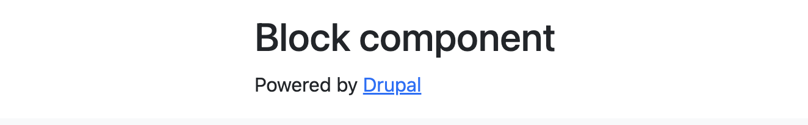
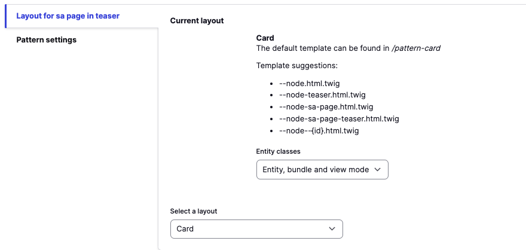
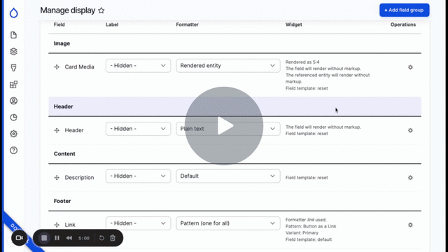

# Developer documentation

Once Saplings is installed on your environment, as it is done via recipes and not modules for the content types, components and themes,  you are free to remove content types and components or modify their display as you wish.

The child theme is also yours to modify. You can easily rename the label of components and remove styles from the components. For example, if you prefer the name “Lightly toasted cheese sandwich” over “Multi-Item Carousel,” change the label of the component to your heart's content.

We recommend that you retain the padding and margin fields, set defaults for them, and then hide them from the form display if you don’t wish to allow the clients to alter them. You can also set default widths on components and the container width. Removing the fields will mean you must make more adjustments within the theme templates, so just setting defaults and removing them from the form display will suffice. We recommend keeping the keys for the settings. Still, if you would like to update the names of, for example, background colors to Red and Green instead of Primary and Secondary (it’s gonna look like a Christmas tree, but go for it), this can be done and added to your site’s configuration. The theme will still use the bootstrap variables to display the correct colors. Now go hog wild and make this site your own!

## Theming

The `saplings_child` theme is a child theme of the `ui_suite_bootstrap` theme. The majority of the patterns and templates are coming from the `ui_suite_bootstrap` theme. However some custom patterns and templates have been added to the `saplings_child` theme for our use cases. There is a base paragraph template located in the `saplings_child/templates/overrides/paragraphs` directory.


## Patterns

New custom patterns should be created in the `templates/patterns` folder of your active theme.

To use patterns to display content, you will need a `.yml` file which will define your available settings, your fields (aka slots) where you will be able to place fields with your defined pattern, and a twig template to display your content in drupal.

Here is an example .`yml` field which shows the available settings and also fields for a simple card: \
[https://github.com/kanopi/saplings_child/blob/main/templates/patterns/simple_card/simple_card.ui_patterns.yml](https://github.com/kanopi/saplings_child/blob/main/templates/patterns/simple_card/simple_card.ui_patterns.yml)

Here is an example of a twig template for the display of the card: \
[https://github.com/kanopi/saplings_child/blob/main/templates/patterns/simple_card/pattern-simple-card.html.twig](https://github.com/kanopi/saplings_child/blob/main/templates/patterns/simple_card/pattern-simple-card.html.twig)

If you have also set up a `preview.html.twig` file like this:

[https://github.com/kanopi/saplings_child/blob/main/templates/patterns/simple_card/pattern-simple-card--preview.html.twig](https://github.com/kanopi/saplings_child/blob/main/templates/patterns/simple_card/pattern-simple-card--preview.html.twig) then you should be able to view your pattern at the following url on your site. /patterns

For example, all current patterns can be seen here as a preview:  [https://dev-saplingscms.pantheonsite.io/patterns](https://dev-saplingscms.pantheonsite.io/patterns)

If set up correctly, patterns can also be viewed as stand alone items:  [https://dev-saplingscms.pantheonsite.io/patterns/blockquote](https://dev-saplingscms.pantheonsite.io/patterns/blockquote)


### Configuring the entire entity as a pattern

Patterns can be used by configuring the entire entity to display as a pattern, such as we do with the Node teasers `/admin/structure/types/manage/sa_page/display/teaser`


<p id="gdcalert24" ><span style="color: red; font-weight: bold">>>>>>  gd2md-html alert: inline image link here (to assets/images/image24.png). Store image on your image server and adjust path/filename/extension if necessary. </span><br>(<a href="#">Back to top</a>)(<a href="#gdcalert25">Next alert</a>)<br><span style="color: red; font-weight: bold">>>>>> </span></p>





In this example, the Page Teaser is set to using a Card layout.

<p id="gdcalert25" ><span style="color: red; font-weight: bold">>>>>>  gd2md-html alert: inline image link here (to assets/images/image25.png). Store image on your image server and adjust path/filename/extension if necessary. </span><br>(<a href="#">Back to top</a>)(<a href="#gdcalert26">Next alert</a>)<br><span style="color: red; font-weight: bold">>>>>> </span></p>





This can also be done on a paragraph like we do on the paragraph carousel item display as seen here:


```
/admin/structure/paragraphs_type/sa_carousel_item/display
```


Under Pattern Settings, choose your desired layout. Once you have saved the change, you will be presented with the available slots for your pattern. From there you can drag and drop the fields into the preferred slots.


<p id="gdcalert26" ><span style="color: red; font-weight: bold">>>>>>  gd2md-html alert: inline image link here (to assets/images/image26.png). Store image on your image server and adjust path/filename/extension if necessary. </span><br>(<a href="#">Back to top</a>)(<a href="#gdcalert27">Next alert</a>)<br><span style="color: red; font-weight: bold">>>>>> </span></p>


### Configuring Fields as a pattern

Patterns can also be used to display fields as a pattern, like can be seen here `/admin/structure/paragraphs_type/sa_carousel/display`

[Displaying Patterns and Field Templates - Watch Video](https://www.loom.com/share/32b8cb87b1fc450a8fe27a51275fa709)


<p id="gdcalert27" ><span style="color: red; font-weight: bold">>>>>>  gd2md-html alert: inline image link here (to assets/images/image27.gif). Store image on your image server and adjust path/filename/extension if necessary. </span><br>(<a href="#">Back to top</a>)(<a href="#gdcalert28">Next alert</a>)<br><span style="color: red; font-weight: bold">>>>>> </span></p>


### Configuring Field groups as a pattern

Another way to display something as a pattern is to do so as a field group. To do this:


1. On the entity type you are editing, click **Add Field Group**
2. From the dropdown list, choose Pattern and add your Field group label
3. Drag your group into its desired location on the Manage display page
4. Arrange the fields in the order that you would like them to display in the pattern slots

[Manage display | Drush Site-Install - 7 March 2024 - Watch Video](https://www.loom.com/share/e73273e5362941e7b76c2276a8a58719)


<p id="gdcalert28" ><span style="color: red; font-weight: bold">>>>>>  gd2md-html alert: inline image link here (to assets/images/image28.gif). Store image on your image server and adjust path/filename/extension if necessary. </span><br>(<a href="#">Back to top</a>)(<a href="#gdcalert29">Next alert</a>)<br><span style="color: red; font-weight: bold">>>>>> </span></p>





## Colors and theme settings

Updating the colors and the theme settings can be done on this page


```
/admin/appearance/css-variables/saplings_child
```


Available options are many, but some of the most used variables will be for Button and Color variants. If there is a bootstrap variable you would like to update, check in the available variables that the theme offers before attempting to alter those variables in  your theme.

Theme settings will be stored in a configuration `.yml` file.

Note that some variables can be set only as  RBG variables while some allow for Hex variables. At this time you are not able to copy and paste your hex key color codes into the options boxes so this will need to be done manually.

To quickly convert your [HEX variables to RGB](https://www.rapidtables.com/convert/color/hex-to-rgb.html)

[Updating Color Variables in Your Site - Watch Video](https://www.loom.com/share/44e2ae132ac1442db61c6a5e8a5a98fa)


<p id="gdcalert29" ><span style="color: red; font-weight: bold">>>>>>  gd2md-html alert: inline image link here (to assets/images/image29.gif). Store image on your image server and adjust path/filename/extension if necessary. </span><br>(<a href="#">Back to top</a>)(<a href="#gdcalert30">Next alert</a>)<br><span style="color: red; font-weight: bold">>>>>> </span></p>


